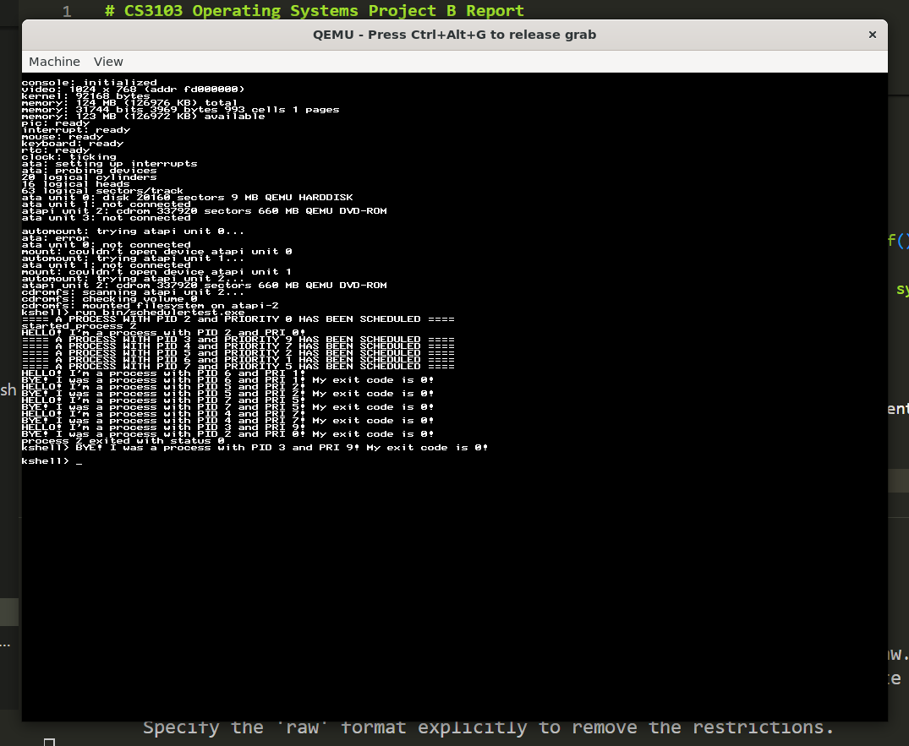
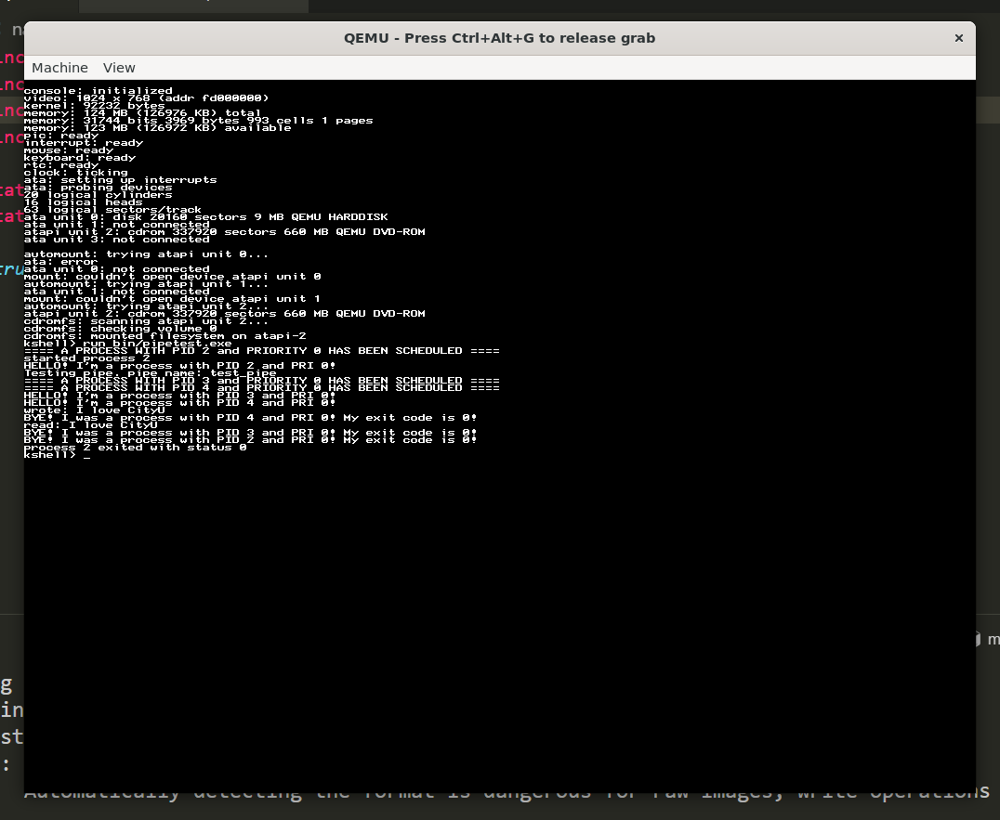
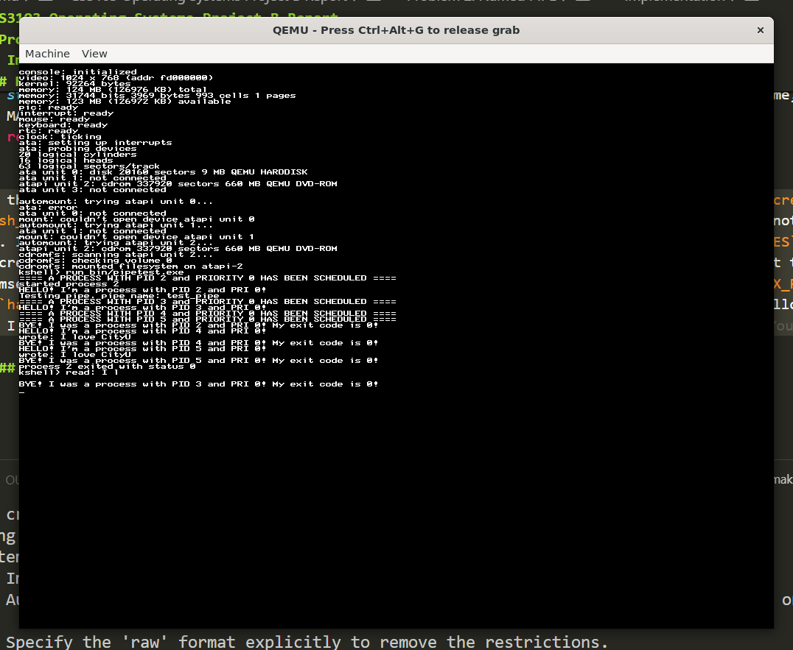

# CS3103 Operating Systems Project B Report
This is a report for Project B of CS3103 Operating Systems, 2024 semester B in City University of Hong Kong. The result source code is also available at [my GitHub repository](https://github.com/TrulyBright/basekernel).
## Group Members
- 40147213 LEE Jinmyoung (alone)

## Problem 1: Process Scheduler with Priority Scheduling Policy
### Analysis of Original Source Code
Let's examine the original source code first. The following three files are necessary to figure out how scheduler works.
- `process.c`
- `clock.c`
- `syscall_handler.c`

Reading those three, we can describe the process scheduler as follows.

1. On startup, `process_init()` creates the first process. The `current` variable, a pointer to currently running process, is set to the pointer to that first process.
1. Once we create a process via syscall, the syscall handler calls `process_launch()`. `process_launch()` pushes the new process to the `ready_list`, the list of processes ready to run.
1. `process_switch()` is the core of context switching. It sets the `current` to the new process fetched from `ready_list` and restores its context (i.e., register & stack) for it to run afterward. There are many functions that call `process_switch()`.
1. Meanwhile, the clock periodically interrupts CPU to run `clock_interrupt()`, where `process_preempt()` is called. `process_preempt()` is a function that calls `process_switch()` only if `allow_preempt` is set to `1` and other conditions are met.

Now that we understand how the scheduler works, let's move on to its modification.

### Defining Priority of Processes
This is the original definition of `struct process`.
```c
struct process {
	struct list_node node;
	int state;
	int exitcode;
	int exitreason;
	struct pagetable *pagetable;
	char *kstack;
	char *kstack_top;
	char *kstack_ptr;
	struct kobject *ktable[PROCESS_MAX_OBJECTS];
	struct process_stats stats;
	uint32_t pid;
	uint32_t ppid;
	uint32_t vm_data_size;
	uint32_t vm_stack_size;
	uint32_t waiting_for_child_pid;
};
```
I initially considered to add `priority` field here. But the type of its first field, `struct list_node`, already had `priority` as below.
```cpp
// kernel/list.c
struct list_node {
	struct list_node *next;
	struct list_node *prev;
	struct list *list;
	int priority;
};
```
So I just used the existing `process.node->priority`. Nothing modified here.
### Ordering Processes by Priority
There are two ways to _sort_ `ready_list`.
- $O(n)$ approach: Every time a new process is added to `ready_list`, do a linear search to find the right place to insert it. The first element has the highest priority.
    - Time complexity of insertion: $O(n)$. This is the running time of `process_launch()`.
    - Time complexity of deletion: $O(1)$. Here, deletion means popping the first element.
    - Time complexity of `process_switch()`: $O(n)$. It inserts the `current` and deletes the first element to set to `current`. Thus $O(n) + O(1) = O(n)$.
- $O(\log n)$ approach: Use a heap or red-black tree like in [CFS](https://docs.kernel.org/scheduler/sched-design-CFS.html) to maintain the order of `ready_list`. The first element has the highest priority.
    - Time complexity of insertion: $O(\log n)$
    - Time complexity of deletion: $O(\log n)$
    - Time complexity of `process_switch()`: $O(\log n)$ for the same reason as above.

I chose the first approach because:
- It is simple.
- The number of processes is expected to be small.
- In the second approach, we need to replace the `node` field in the definition of `struct process` with a new field that points to the heap or red-black tree node. The problem is many existing codes (e.g., `pipe.c`) assume that `struct process` has a member of type `struct list_node`. Once we change it, we need to refactor all those dependent codes. It is a huge task.

Thanks to the original author, `list.h` already had a function `list_push_priority()`. I used it to replace `list_push_tail()` in `process_launch()` and `process_switch()`:
```cpp
// kernel/process.c
void process_launch(struct process *p)
{
    printf("==== A PROCESS WITH PID %u and PRIORITY %u HAS BEEN SCHEDULED ====\n", p->pid, p->node.priority); // as required in the project specification.
    // list_push_tail(&ready_list, &p->node); commented out
    list_push_priority(&ready_list, &p->node, p->node.priority);
}

// ...

static void process_switch(struct process *p)
{
    // ...
    if(newstate == PROCESS_STATE_READY) {
        // list_push_tail(&ready_list, &current->node); commented out
        list_push_priority(&ready_list, &current->node, current->node.priority);
    }
    // ...
}
```
`list_push_priority()` calls `list_push_tail()` if the list is empty. But in the original codebase, it set the `priority` of the new node to `0` for some reason. I removed that line.
```cpp
// kernel/list.c
void list_push_tail(struct list *list, struct list_node *node)
{
    node->prev = list->tail;
    node->next = 0;
    // node->priority = 0; commented out
    if(list->tail)
            list->tail->next = node;
    list->tail = node;
}
```
### Allowing Preemption
So far we didn't allow preemption. Let's set the global variable `allow_preempt` to `1` and modify the other conditions.
```cpp
// kernel/process.c
// int allow_preempt = 0; commented out
int allow_preempt = 1;

void process_preempt()
{
    // if(allow_preempt && current && ready_list.head) { commented out
    if(
        allow_preempt
        && current
        && ready_list.head
        && ready_list.head->priority <= current->node.priority
    )
        process_switch(PROCESS_STATE_READY);
}
```
Note that it preempts even when the preempted has the same priority as the new. I chose to let them run alternately if there are multiple processes with the same priority.
### Modification of `syscall_process_run()`
The specification of the project says the user program can set the priority of a process. To do that, I chose to give `syscall_process_run()` a new parameter `pri`:
```cpp
// library/syscalls.c
// int syscall_process_run(int fd, int argc, const char **argv) commented out
int syscall_process_run(int fd, int argc, const char **argv, uint32_t pri)
{
    // return syscall(SYSCALL_PROCESS_RUN, fd, argc, (uint32_t) argv, 0, 0); commented out
    return syscall(SYSCALL_PROCESS_RUN, fd, argc, (uint32_t) argv, pri, 0);
}
```
Then I modified the corresponding handler:
```cpp
// kernel/syscall_handler.c

// int sys_process_run( int fd, int argc, const char **argv) commented out
int sys_process_run(int fd, int argc, const char **argv, uint32_t pri)
{
    // ...
    /* Create the child process */
    struct process *p = process_create();
    p->node.priority = pri; // I added this line.
    process_inherit(current, p);
    // ...
}

// ...
int32_t syscall_handler(syscall_t n, uint32_t a, uint32_t b, uint32_t c, uint32_t d, uint32_t e)
{
    // ...
    case SYSCALL_PROCESS_RUN:
        // return sys_process_run(a, b, (const char **)c); commented out
        return sys_process_run(a, b, (const char **)c, d);
}
```

For convenience, I rewrote `user-start.c` to print the priority on start and exit.
```cpp
#include "library/syscalls.h"
#include "library/string.h"

int main(int argc, const char *argv[]);

void _start(int argc, const char **argv)
{
    printf("HELLO! I'm a process with PID %d and PRI %d!\n", syscall_process_self(), syscall_process_pri());
    const int exit_code = main(argc, argv);
    printf("BYE! I was a process with PID %d and PRI %d! My exit code is %d!\n", syscall_process_self(), syscall_process_pri(), exit_code);
    syscall_process_exit(exit_code);
}
```
`syscall_process_pri()` is a new syscall I added to get the priority of the current process. The implementation is straightforward, so I omit it here.
### Testing
This is `schedulertest.c`.
```cpp
#include "kernel/types.h"
#include "library/syscalls.h"
#define NULL 0

typedef struct {
    const char *path;
    const uint32_t pri;
} ExecInfo;

int main(void) {
    const ExecInfo a[] = {
        {"/bin/process1.exe", 9},
        {"/bin/process2.exe", 7},
        {"/bin/process3.exe", 2},
        {"/bin/process4.exe", 1},
        {"/bin/process5.exe", 5},
    };
    const int size = (int) (sizeof(a) / sizeof(a[0]));
    for (int i = 0; i < size; i++) {
        const int pfd = syscall_open_file(KNO_STDDIR, a[i].path, 0, 0);
        syscall_process_run(pfd, 0, NULL, a[i].pri);
        syscall_object_close(pfd);
    }
    struct process_info info;
    syscall_process_wait(&info, 0);
    return 0;
}
```
`process1.c`, `process2.c`, `process3.c`, `process4.c` and `process5.c` have the same content:
```cpp
#include "library/assignment.h"

int main(void) {
    runForSeconds(5);
    return 0;
}
```
`assignment.h` is a library that contains `runForSeconds()` given in the project specification.

Run `make run` and type `run bin/schedulertest.exe` inside. Below is the result, where the processes are run by priority.

You don't have to run `automount`. I modified `kshell_launch()` to automatically run it on startup.

## Problem 2: Named PIPE
The original codebase had unnamed pipe implemented. I implemented named pipe based on it.

### Header
`named_pipe.h` is as follows.
```cpp
#pragma once
#include "list.h"
#define PIPE_SIZE PAGE_SIZE
#define MAX_NAMED_PIPES 256
struct named_pipe {
    const char* fname;
    char *buffer;
    int read_pos;
    int write_pos;
    int flushed;
    int refcount;
    struct list queue;
};
struct named_pipe *named_pipe_create(const char* fname);
struct named_pipe *named_pipe_addref(struct named_pipe *np);
void named_pipe_delete(struct named_pipe *np);
void named_pipe_flush(struct named_pipe *np);

int named_pipe_write(struct named_pipe *np, char *buffer, int size);
int named_pipe_write_nonblock(struct named_pipe *np, char *buffer, int size);
int named_pipe_read(struct named_pipe *np, char *buffer, int size);
int named_pipe_read_nonblock(struct named_pipe *np, char *buffer, int size);
int named_pipe_size(struct named_pipe *np);
struct named_pipe *named_pipe_lookup(const char* fname);
```
It is mostly the same as `pipe.h`. The only notable difference is that we have a new function `named_pipe_lookup()` for anyone to find a named pipe by its name.

### Implementation
How to look up named pipe? I had two options:
- Array approach: Linear search through the array of named pipes. Easy.
    - Time complexity of lookup: $O(n)$ on average. This is the running time of `named_pipe_lookup()`, `named_pipe_create()`, and `named_pipe_delete()` because they all need to check if the given name exists.
- Hash table approach: Use a hash table to store named pipes. Harder.
    - Time complexity of lookup: $O(1)$ on average. $O(n)$ in the worst case.

I chose to implement the easier approach first and later change it to the harder.

#### Array Approach
First, write global variables.
```cpp
// kernel/named_pipe.c
static struct named_pipe *named_pipes[MAX_NAMED_PIPES];
static int last_named_pipe_index = 0;
static int named_pipe_count = 0;
```
It's quite straightforward.

Then, write `named_pipe_create()`, `named_pipe_delete()` and `named_pipe_lookup()`:
```cpp
// kernel/named_pipe.c
struct named_pipe *named_pipe_create(const char* fname) {
    if (named_pipe_count >= MAX_NAMED_PIPES) return 0;
    struct named_pipe *existing = named_pipe_lookup(fname); // O(n)
    if (existing) {
        named_pipe_delete(existing);
        return 0; // fail if the name already exists
    }
    struct named_pipe *np = kmalloc(sizeof(struct named_pipe));
    np->fname = fname;
    np->buffer = page_alloc(1);
    if (!np->buffer) {
        kfree(np);
        return 0;
    }
    named_pipes[last_named_pipe_index++] = np;
    last_named_pipe_index %= MAX_NAMED_PIPES; // wrap around
    named_pipe_count++;
    // ... initialize other fields
    return np;
}

void named_pipe_delete(struct named_pipe *np) {
    if (!np) return;
    np->refcount--;
    if (np->refcount == 0) {
        for (int i = 0; i < MAX_NAMED_PIPES; i++) // O(n)
            if (named_pipes[i] == np) {
                named_pipes[i] = 0;
                break;
            }
        if (np->buffer) page_free(np->buffer);
        kfree(np);
        named_pipe_count--;
    }
}

// automatically increments refcount.
struct named_pipe *named_pipe_lookup(const char* fname) {
    // TODO: replace loop with a hash table for faster lookup
    for (int i = 0; i < MAX_NAMED_PIPES; i++) // O(n)
        if (named_pipes[i] && named_pipes[i]->fname == fname)
            return named_pipe_addref(named_pipes[i]);
    return 0;
}
```
Note that `named_pipe_lookup()` always increments refcount. I chose to do so because the caller may want to use the named pipe right after looking it up.

`write()` and `read()` have the same logic as those in `pipe.c`. The following is my implementation, which is more clear and shorter than the original.
```cpp
// kernel/named_pipe.c
static int named_pipe_write_internal(struct named_pipe *np, char *buffer, int size, int blocking) {
    if (!np || !buffer) return -1;
    if (np->flushed) return 0;
    int written = 0;
    while (written < size) {
        if (np->read_pos == (np->write_pos + 1) % PIPE_SIZE) {
            if (!blocking) return written;
            if (np->flushed) {
                np->flushed = 0;
                return written;
            }
            process_wait(&np->queue);
            continue;
        }
        np->buffer[np->write_pos++] = buffer[written++];
        np->write_pos %= PIPE_SIZE;
    }
    if (blocking) process_wakeup_all(&np->queue);
    np->flushed = 0;
    return written;
}
static int named_pipe_read_internal(struct named_pipe *np, char *buffer, int size, int blocking) {
    if (!np || !buffer) return -1;
    if (np->flushed) return 0;
    int read = 0;
    while (read < size) {
        np->read_pos %= PIPE_SIZE;
        if (np->read_pos == np->write_pos) {
            if (!blocking) return read;
            if (np->flushed) {
                np->flushed = 0;
                return read;
            }
            process_wait(&np->queue);
            continue;
        }
        buffer[read++] = np->buffer[np->read_pos++];
    }
    if (blocking) process_wakeup_all(&np->queue);
    np->flushed = 0;
    return read;
}
```
The buffer is full if `np->read_pos == (np->write_pos + 1) % PIPE_SIZE`. The buffer is empty if `np->read_pos == np->write_pos`. So there can be up to `PIPE_SIZE - 1` bytes written in the buffer. `read()` blocks if the buffer is empty and `blocking` is set, and `write()` blocks if the buffer is full and `blocking` is set.

##### Testing of Array Approach
The implemenations of `sender.c` and `receiver.c` are at the end of this "Problem 2" section. Run `make run` and type `run bin/pipetest.exe` inside. Below is the result.

It works fine!

#### Hash Table Approach
Now let's replace the array with a hash table. Thanks to the original author again, we already had `hash_set.h` and `hash_set.c`. But I didn't use it just as it is to partially avoid dynamic memory allocation. Look at the following code of `hash_set_create()`:
```cpp
// kernel/hash_set.c
struct hash_set *hash_set_create(unsigned buckets)
{
	struct hash_set_node **set_nodes = kmalloc(sizeof(struct hash_set_node *) * buckets);
	struct hash_set *set = kmalloc(sizeof(struct hash_set));
	memset(set_nodes, 0, sizeof(struct hash_set_node *) * buckets);

	set->total_buckets = buckets;
	set->head = set_nodes;
	set->num_entries = 0;

	if(!set || !set_nodes) {
		hash_set_delete(set);
		return 0;
	}
	return set;
}
```
It uses `kmalloc()` twice, once for `set_nodes*` and once for `set`. This is useful if the number of buckets is not known at compile time. But in our case, we know the number of named pipes at compile time. It is `MAX_NAMED_PIPES`.

That's why I declared a hash table statically in `named_pipe.c`:
```cpp
// kernel/named_pipe.c
static struct hash_set_node *nodes[MAX_NAMED_PIPES] = {};
static struct hash_set named_pipes = {
    .num_entries = 0,
    .total_buckets = MAX_NAMED_PIPES,
    .head = nodes
};
```
This way, we can create a `hash_set` without `kmalloc()`. It's faster and has better cache locality. It's also more reliable because `kmalloc()`, which can fail, is not used.

Then, modify `named_pipe_create()`, `named_pipe_delete()` and `named_pipe_lookup()`:
```cpp
// kernel/named_pipe.c
struct named_pipe *named_pipe_create(const char* fname) {
    // ...
    hash_set_add(&named_pipes, hash_string(fname, 0, MAX_NAMED_PIPES), np);
    // ...
}

void named_pipe_delete(struct named_pipe *np) {
    // ...
    if (np->refcount == 0) {
        hash_set_remove(&named_pipes, hash_string(np->fname, 0, MAX_NAMED_PIPES));
        // ...
    }
}

// automatically increments refcount.
struct named_pipe *named_pipe_lookup(const char* fname) {
    struct named_pipe *np = (struct named_pipe *)hash_set_lookup(&named_pipes, hash_string(fname, 0, MAX_NAMED_PIPES));
    return np ? named_pipe_addref(np) : 0;
}
```
One thing to note is that I didn't completely get rid of dynamic allocation. When `named_pipe_create()` calls `hash_set_add()`, it internally calls `kmalloc()` to allocate a new `hash_set_node`. So, it's not fully reliable yet. It can still fail when we create a new pipe although the kernel guarantees `MAX_NAMED_PIPES` named pipes can be created. This is because we statically declared an array of pointers to `hash_set_node`, not the nodes themselves. To completely avoid dynamic allocation, we need to declare `hash_set_node nodes[MAX_PIPE_SIZE]` instead of `hash_set_node *nodes[MAX_PIPE_SIZE]` and write new functions particularly for statically allocated hash tables. But I didn't do that because it's a bit complicated and not necessary for this project.

##### Testing of Hash Table Approach
Run `make run` and type `run bin/pipetest.exe` inside. Below is the result.

It works fine again!

### `sender.c` and `receiver.c`
I created `pipetest.exe` to run `sender.exe` and `receiver.exe` concurrently. Below is its source code.
```cpp
// kernel/pipetest.c
#include "library/syscalls.h"
#include "library/string.h"

int main(void) {
    const char *pipe_name = "test_pipe";
    const char *sender_exe = "/bin/sender.exe",
               *receiver_exe = "/bin/receiver.exe";
    printf("Testing pipe. pipe name: %s\n", pipe_name);
    const int fd_sender1 = syscall_open_file(KNO_STDDIR, sender_exe, 0, 0),
              fd_sender2 = syscall_open_file(KNO_STDDIR, sender_exe, 0, 0),
              fd_receiver = syscall_open_file(KNO_STDDIR, receiver_exe, 0, 0);
    if (fd_sender1 < 0 || fd_sender2 < 0 || fd_receiver < 0) {
        printf("Failed to open file: %d %d %d\n", fd_sender1, fd_sender2, fd_receiver);
        return 1;
    }
    const char *content = "I love CityU";
    const int content_length = strlen(content) + 1;
    char buffer[3];
    uint_to_string(content_length * 2, buffer);
    const char *argv_receiver[] = {receiver_exe, pipe_name, buffer};
    const char *argv_sender[] = {sender_exe, pipe_name, content};
    syscall_process_run(fd_receiver, 3, argv_receiver, 0);
    syscall_process_run(fd_sender1, 3, argv_sender, 0);
    syscall_process_run(fd_sender2, 3, argv_sender, 0);
    syscall_object_close(fd_receiver);
    syscall_object_close(fd_sender1);
    syscall_object_close(fd_sender2);
    return 0;
}
```
It creates two sender processes and one receiver process. The sender processes write the same string `"I love CityU"` to the named pipe, and the receiver process reads bytes that are twice the length of the string. All three of them run concurrently because they have the same priority. This is one reason that I chose to let processes with the same priority run alternately in Problem 1. If I didn't allow preemption on the same priority, the sender processes would have run first, and the receiver process would have waited until the sender processes finish. Yeah, I could just let the receiver process run first and be blocked until the sender processes write to the pipe. But I wanted to show the concurrency.

Below is `sender.c`.
```cpp
#include "library/syscalls.h"
#include "library/string.h"

int main(const int argc, const char** argv) {
    int fd = syscall_open_named_pipe(argv[1]);
    if (fd < 0) {
        printf("Failed to open named pipe: %d\n", fd);
        return 1;
    }
    const char *content = argv[2];
    const int content_size = strlen(content) + 1;
    syscall_object_write(fd, content, content_size, 0);
    printf("wrote: %s\n", content);
    return 0;
}
```
Below is `reciever.c`.
```cpp
#include "library/string.h"
#include "library/syscalls.h"

int main(const int argc, const char** argv) {
    int fd = syscall_make_named_pipe(argv[1]);
    if (fd < 0) {
        printf("Failed to create named pipe: %d\n", fd);
        return 1;
    }
    int failing_fd = syscall_make_named_pipe(argv[1]);
    if (failing_fd >= 0) {
        printf("Named pipe creation should have failed\n");
        return 1;
    }
    const int content_size = strlen(argv[2]) + 1;
    char buffer[content_size];
    syscall_object_read(fd, buffer, content_size, 0);
    printf("read: %s\n", buffer);
    return 0;
}
```
Note that `reciever.c` tries to create a named pipe with the same name twice. The second attempt should fail.

## List of Relevant Functions and values
The followings are the new functions and values I added to the original codebase.

`include/kernel/syscall.h`:
```cpp
typedef enum {
    // ...
    SYSCALL_PROCESS_PRI, // get the priority of the current process
    SYSCALL_MAKE_NAMED_PIPE, // create a named pipe
	SYSCALL_OPEN_NAMED_PIPE, // open a named pipe
    // ...
} syscall_t;
```
`include/kernel/types.h`:
```cpp
typedef enum {
    // ...
    KOBJECT_NAMED_PIPE, // named pipe
    // ...
} kobject_type_t;
```
`include/library/assignment.h`:
```cpp
// block for `seconds` seconds
void runForSeconds(int seconds);
```
`include/library/syscalls.h`:
```cpp
// run a process with priority `pri`. return the pid of that process.
int syscall_process_run(int fd, int argc, const char **argv, uint32_t pri);
// return the priority of the current process.
int syscall_process_pri();
```
`kernel/kobject.h`:
```cpp
struct kobject {
    // ...
    union {
        // ...
        struct named_pipe *named_pipe; // added this line.
        // ...
    } data;
    // ...
}
struct kobject *kobject_create_named_pipe(struct named_pipe *p);
```
`kernel/kobject.c`:
```cpp
// get a named pipe. return a kobject whose type is KOBJECT_NAMED_PIPE and data is the named pipe.
struct kobject *kobject_create_named_pipe(struct named_pipe *np)
{
	struct kobject *k = kobject_create();
	k->type = KOBJECT_NAMED_PIPE;
	k->data.named_pipe = np;
	return k;
}
```
`kernel/named_pipe.h`:
```cpp
struct named_pipe {
    const char* fname;
    char *buffer;
    int read_pos;
    int write_pos;
    int flushed;
    int refcount;
    struct list queue;
};

// create a named pipe with the given name. return the named pipe.
struct named_pipe *named_pipe_create(const char* fname);
// increment the refcount of the named pipe and return it.
struct named_pipe *named_pipe_addref(struct named_pipe *np);
// decrement the refcount of the named pipe. delete it if the refcount is 0.
void named_pipe_delete(struct named_pipe *np);
// mark the named pipe as flushed.
void named_pipe_flush(struct named_pipe *np);
// write to the named pipe. return the number of bytes written.
int named_pipe_write(struct named_pipe *np, char *buffer, int size);
// write to the named pipe. return the number of bytes written. non-blocking version.
int named_pipe_write_nonblock(struct named_pipe *np, char *buffer, int size);
// read from the named pipe. return the number of bytes read.
int named_pipe_read(struct named_pipe *np, char *buffer, int size);
// read from the named pipe. return the number of bytes read. non-blocking version.
int named_pipe_read_nonblock(struct named_pipe *np, char *buffer, int size);
// return the number of bytes in the named pipe.
int named_pipe_size(struct named_pipe *np);
// look up the named pipe by its name. return the named pipe.
struct named_pipe *named_pipe_lookup(const char* fname);
```
`kernel/named_pipe.c`:
```cpp
// Q. Why not use hash_set_create()?
// A. We know the number of buckets that is constant all the time.
//    Thus we avoid dynamic memory allocation here.
static struct hash_set_node *nodes[MAX_NAMED_PIPES] = {};
static struct hash_set named_pipes = {
    .num_entries = 0,
    .total_buckets = MAX_NAMED_PIPES,
    .head = nodes
};

struct named_pipe *named_pipe_create(const char* fname) {
    if (named_pipes.num_entries >= MAX_NAMED_PIPES) return 0;
    struct named_pipe *existing = named_pipe_lookup(fname);
    if (existing) {
        named_pipe_delete(existing); // decrease refcount
        return 0;
    }
    struct named_pipe *np = kmalloc(sizeof(struct named_pipe));
    np->fname = fname;
    np->buffer = page_alloc(1);
    if (!np->buffer) {
        kfree(np);
        return 0;
    }
    hash_set_add(&named_pipes, hash_string(fname, 0, MAX_NAMED_PIPES), np);
    np->read_pos = 0;
    np->write_pos = 0;
    np->flushed = 0;
    np->queue.head = 0;
    np->queue.tail = 0;
    np->refcount = 1; // default refcount is 1
    return np;
}

struct named_pipe *named_pipe_addref(struct named_pipe *np) {
    np->refcount++;
    return np;
}

void named_pipe_flush(struct named_pipe *np) {
    if (np) {
        np->flushed = 1;
        process_wakeup_all(&np->queue); // wake up all processes waiting on this named pipe to find out it's flushed.
    }
}

void named_pipe_delete(struct named_pipe *np) {
    if (!np) return;
    np->refcount--;
    if (np->refcount == 0) {
        hash_set_remove(&named_pipes, hash_string(np->fname, 0, MAX_NAMED_PIPES));
        if (np->buffer) page_free(np->buffer);
        kfree(np);
    }
}

static int named_pipe_write_internal(struct named_pipe *np, char *buffer, int size, int blocking) {
    if (!np || !buffer) return -1;
    if (np->flushed) return 0;
    int written = 0;
    while (written < size) {
        if (np->read_pos == (np->write_pos + 1) % PIPE_SIZE) {
            if (!blocking) return written;
            if (np->flushed) {
                np->flushed = 0;
                return written;
            }
            process_wait(&np->queue);
            continue;
        }
        np->buffer[np->write_pos++] = buffer[written++];
        np->write_pos %= PIPE_SIZE;
    }
    if (blocking) process_wakeup_all(&np->queue);
    np->flushed = 0;
    return written;
}

int named_pipe_write(struct named_pipe *np, char *buffer, int size) {
    return named_pipe_write_internal(np, buffer, size, 1);
}

int named_pipe_write_nonblock(struct named_pipe *np, char *buffer, int size) {
    return named_pipe_write_internal(np, buffer, size, 0);
}

static int named_pipe_read_internal(struct named_pipe *np, char *buffer, int size, int blocking) {
    if (!np || !buffer) return -1;
    if (np->flushed) return 0;
    int read = 0;
    while (read < size) {
        np->read_pos %= PIPE_SIZE;
        if (np->read_pos == np->write_pos) {
            if (!blocking) return read;
            if (np->flushed) {
                np->flushed = 0;
                return read;
            }
            process_wait(&np->queue);
            continue;
        }
        buffer[read++] = np->buffer[np->read_pos++];
    }
    if (blocking) process_wakeup_all(&np->queue);
    np->flushed = 0;
    return read;
}

int named_pipe_read(struct named_pipe *np, char *buffer, int size) {
    return named_pipe_read_internal(np, buffer, size, 1);
}

int named_pipe_read_nonblock(struct named_pipe *np, char *buffer, int size) {
    return named_pipe_read_internal(np, buffer, size, 0);
}

int named_pipe_size(struct named_pipe *np) {
    if (!np) return -1;
    return (np->write_pos - np->read_pos) % PIPE_SIZE;
}

// automatically increments refcount.
struct named_pipe *named_pipe_lookup(const char* fname) {
    struct named_pipe *np = (struct named_pipe *)hash_set_lookup(&named_pipes, hash_string(fname, 0, MAX_NAMED_PIPES));
    return np ? named_pipe_addref(np) : 0;
}
```
`kernel/syscall_handler.c`:
```cpp
// return the priority of the current process.
int sys_process_pri()
{
	return current->node.priority;
}
// create a named pipe with the given name. return the fd of the named pipe.
int sys_make_named_pipe(const char *fname)
{
	int fd = process_available_fd(current);
	if(fd < 0) return KERROR_OUT_OF_OBJECTS;
	struct named_pipe *existing = named_pipe_lookup(fname);
	if (existing) {
		named_pipe_delete(existing); // decrease refcount
		return KERROR_FILE_EXISTS;
	}
	struct named_pipe *np = named_pipe_create(fname);
	if(!np) return KERROR_OUT_OF_MEMORY;
	current->ktable[fd] = kobject_create_named_pipe(np);
	return fd;
}
// open a named pipe with the given name. return the fd of the named pipe.
int sys_open_named_pipe(const char *fname)
{
	int fd = process_available_fd(current);
	if(fd < 0) return KERROR_OUT_OF_OBJECTS;
	struct named_pipe *np = named_pipe_lookup(fname);
	if(!np) return KERROR_NOT_FOUND;
	current->ktable[fd] = kobject_create_named_pipe(np);
	return fd;
}
```
`library/assignment.h`
```cpp
#pragma once
// block for `seconds` seconds
void runForSeconds(int seconds);
```
`include/library/syscalls.h`
```cpp
// run a process with priority `pri`. return the pid of that process.
int syscall_process_run(int fd, int argc, const char **argv, uint32_t pri);
// return the priority of the current process.
int syscall_process_pri();
// create a named pipe with the given name. return the fd of the named pipe.
int syscall_make_named_pipe(const char *fname);
// open a named pipe with the given name. return the fd of the named pipe.
int syscall_open_named_pipe(const char *fname);
```