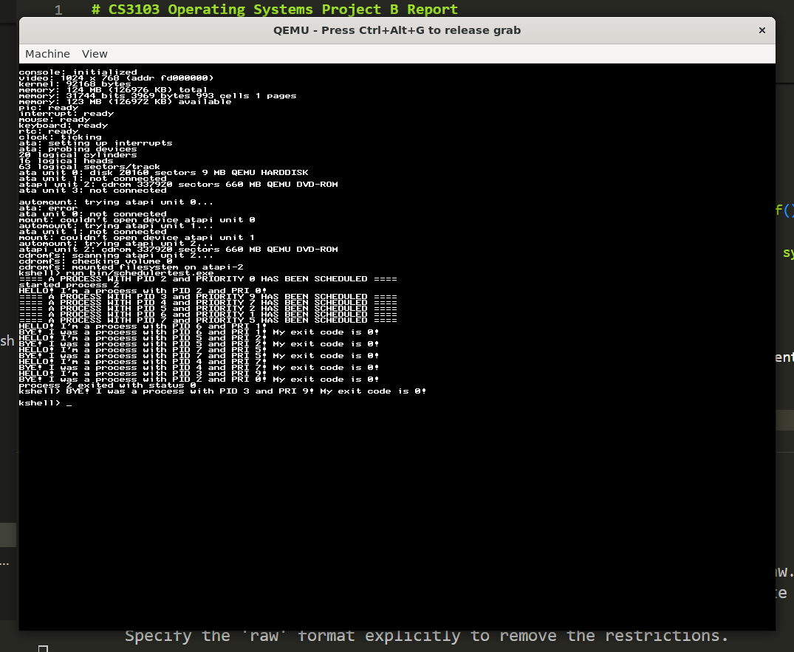

# CS3103 Operating Systems Project B Report
This is a report for Project B of CS3103 Operating Systems, 2024 semester B. The result source code is also available at [my GitHub repository](https://github.com/TrulyBright/basekernel).
## Group Members
- 40147213 LEE Jinmyoung (alone)

## Problem 1: Process Scheduler with Priority Scheduling Policy
### Analysis of Original Source Code
Let's examine the original source code first. The following three files are necessary to figure out how scheduler works.
- `process.c`
- `clock.c`
- `syscall_handler.c`

Reading those three, we can describe the process scheduler as follows.

1. On startup, `process_init()` creates the first process. The `current` variable, a pointer to currently running process, is set to the pointer to that first process.
1. Once we create a process via syscall, the syscall handler calls `process_launch()`. `process_launch()` pushes the new process to the `ready_list`, the list of processes ready to run.
1. `process_switch()` is the core of context switching. It sets the `current` to the new process fetched from `ready_list` and restores its context (i.e., register & stack) for it to run afterward. There are many functions that call `process_switch()`.
1. Meanwhile, the clock periodically interrupts CPU to run `clock_interrupt()`, where `process_preempt()` is called. `process_preempt()` is a function that calls `process_switch()` only if `allow_preempt` is set to `1` and other conditions are met.

Now that we understand how the scheduler works, let's move on to its modification.

### Implementation of Preemptive Priority Scheduling
#### Defining Priority of Processes
This is the original definition of `struct process`.
```c
struct process {
	struct list_node node;
	int state;
	int exitcode;
	int exitreason;
	struct pagetable *pagetable;
	char *kstack;
	char *kstack_top;
	char *kstack_ptr;
	struct kobject *ktable[PROCESS_MAX_OBJECTS];
	struct process_stats stats;
	uint32_t pid;
	uint32_t ppid;
	uint32_t vm_data_size;
	uint32_t vm_stack_size;
	uint32_t waiting_for_child_pid;
};
```
I initially considered to add `priority` field here. But the type of its first field, `struct list_node`, already had `priority` as below.
```cpp
// kernel/list.c
struct list_node {
	struct list_node *next;
	struct list_node *prev;
	struct list *list;
	int priority;
};
```
So I just used the existing `process.node->priority`. Nothing modified here.
#### Ordering Processes by Priority
There are two ways to _sort_ `ready_list`.
- $O(n)$ approach: Every time a new process is added to `ready_list`, do a linear search to find the right place to insert it. The first element has the highest priority.
    - Time complexity of insertion: $O(n)$. This is the running time of `process_launch()`.
    - Time complexity of deletion: $O(1)$. Here, deletion means popping the first element.
    - Time complexity of `process_switch()`: $O(n)$. It inserts the `current` and deletes the first element to set to `current`. Thus $O(n) + O(1) = O(n)$.
- $O(\log n)$ approach: Use a heap or red-black tree like in [CFS](https://docs.kernel.org/scheduler/sched-design-CFS.html) to maintain the order of `ready_list`. The first element has the highest priority.
    - Time complexity of insertion: $O(\log n)$
    - Time complexity of deletion: $O(\log n)$
    - Time complexity of `process_switch()`: $O(\log n)$ for the same reason as above.

I chose the first approach because:
- It is simple.
- The number of processes is expected to be small.
- In the second approach, we need to replace the `node` field in the definition of `struct process` with a new field that points to the heap or red-black tree node. The problem is many existing codes (e.g., `pipe.c`) assume that `struct process` has a member of type `struct list_node`. Once we change it, we need to refactor all those dependent codes. It is a huge task.

Thanks to the original author, `list.h` already had a function `list_push_priority()`. I used it to replace `list_push_tail()` in `process_launch()` and `process_switch()`:
```cpp
// kernel/process.c
void process_launch(struct process *p)
{
    printf("==== A PROCESS WITH PID %u and PRIORITY %u HAS BEEN SCHEDULED ====\n", p->pid, p->node.priority); // as required in the project specification.
    // list_push_tail(&ready_list, &p->node); commented out
    list_push_priority(&ready_list, &p->node, p->node.priority);
}

// ...

static void process_switch(struct process *p)
{
    // ...
    if(newstate == PROCESS_STATE_READY) {
        // list_push_tail(&ready_list, &current->node); commented out
        list_push_priority(&ready_list, &current->node, current->node.priority);
    }
    // ...
}
```
`list_push_priority()` calls `list_push_tail()` if the list is empty. But in the original codebase, it set the `priority` of the new node to `0` for some reason. I removed that line.
```cpp
// kernel/list.c
void list_push_tail(struct list *list, struct list_node *node)
{
    node->prev = list->tail;
    node->next = 0;
    // node->priority = 0; commented out
    if(list->tail)
            list->tail->next = node;
    list->tail = node;
}
```
#### Allowing Preemption
So far we didn't allow preemption. Let's set the global variable `allow_preempt` to `1` and modify the other conditions.
```cpp
// kernel/process.c
// int allow_preempt = 0; commented out
int allow_preempt = 1;

void process_preempt()
{
    // if(allow_preempt && current && ready_list.head) { commented out
    if(
        allow_preempt
        && current
        && ready_list.head
        && ready_list.head->priority <= current->node.priority
    )
        process_switch(PROCESS_STATE_READY);
}
```
Note that it preempts even when the preempted has the same priority as the new. I chose to let them run alternately if there are multiple processes with the same priority.
#### Modification of `syscall_process_run()`
The specification of the project says the user program can set the priority of a process. To do that, I chose to give `syscall_process_run()` a new parameter `pri`:
```cpp
// library/syscalls.c
// int syscall_process_run(int fd, int argc, const char **argv) commented out
int syscall_process_run(int fd, int argc, const char **argv, uint32_t pri)
{
    // return syscall(SYSCALL_PROCESS_RUN, fd, argc, (uint32_t) argv, 0, 0); commented out
    return syscall(SYSCALL_PROCESS_RUN, fd, argc, (uint32_t) argv, pri, 0);
}
```
Then I modified the corresponding handler:
```cpp
// kernel/syscall_handler.c

// int sys_process_run( int fd, int argc, const char **argv) commented out
int sys_process_run(int fd, int argc, const char **argv, uint32_t pri)
{
    // ...
    /* Create the child process */
    struct process *p = process_create();
    p->node.priority = pri; // I added this line.
    process_inherit(current, p);
    // ...
}

// ...
int32_t syscall_handler(syscall_t n, uint32_t a, uint32_t b, uint32_t c, uint32_t d, uint32_t e)
{
    // ...
    case SYSCALL_PROCESS_RUN:
        // return sys_process_run(a, b, (const char **)c); commented out
        return sys_process_run(a, b, (const char **)c, d);
}
```

For convenience, I rewrote `user-start.c` to print the priority on start and exit.
```cpp
#include "library/syscalls.h"
#include "library/string.h"

int main(int argc, const char *argv[]);

void _start(int argc, const char **argv)
{
    printf("HELLO! I'm a process with PID %d and PRI %d!\n", syscall_process_self(), syscall_process_pri());
    const int exit_code = main(argc, argv);
    printf("BYE! I was a process with PID %d and PRI %d! My exit code is %d!\n", syscall_process_self(), syscall_process_pri(), exit_code);
    syscall_process_exit(exit_code);
}
```
`syscall_process_pri()` is a new syscall I added to get the priority of the current process. The implementation is straightforward, so I omit it here.
### Testing
This is `schedulertest.c`.
```cpp
#include "kernel/types.h"
#include "library/syscalls.h"
#define NULL 0

typedef struct {
    const char *path;
    const uint32_t pri;
} ExecInfo;

int main(void) {
    const ExecInfo a[] = {
        {"/bin/process1.exe", 9},
        {"/bin/process2.exe", 7},
        {"/bin/process3.exe", 2},
        {"/bin/process4.exe", 1},
        {"/bin/process5.exe", 5},
    };
    const int size = (int) (sizeof(a) / sizeof(a[0]));
    for (int i = 0; i < size; i++) {
        const int pfd = syscall_open_file(KNO_STDDIR, a[i].path, 0, 0);
        syscall_process_run(pfd, 0, NULL, a[i].pri);
        syscall_object_close(pfd);
    }
    struct process_info info;
    syscall_process_wait(&info, 0);
    return 0;
}
```
`process1.c`, `process2.c`, `process3.c`, `process4.c` and `process5.c` have the same content:
```cpp
#include "library/assignment.h"

int main(void) {
    runForSeconds(5);
    return 0;
}
```
`assignment.h` is a library that contains `runForSeconds()` given in the project specification.

Run `make run` and type `run bin/schedulertest.exe` inside. Below is the result, where the processes are run by priority.

You don't have to run `automount`. I modified `kshell_launch()` to automatically run it on startup.